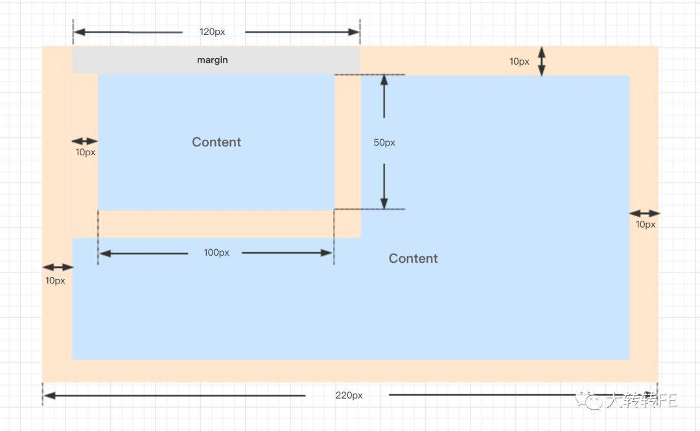
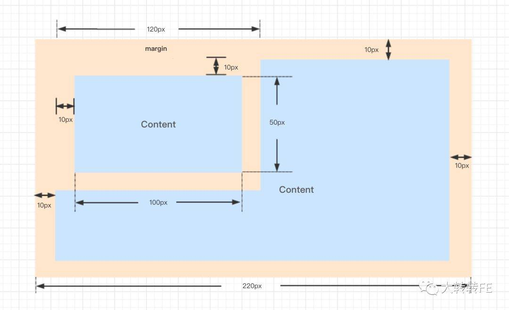
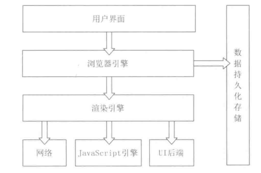
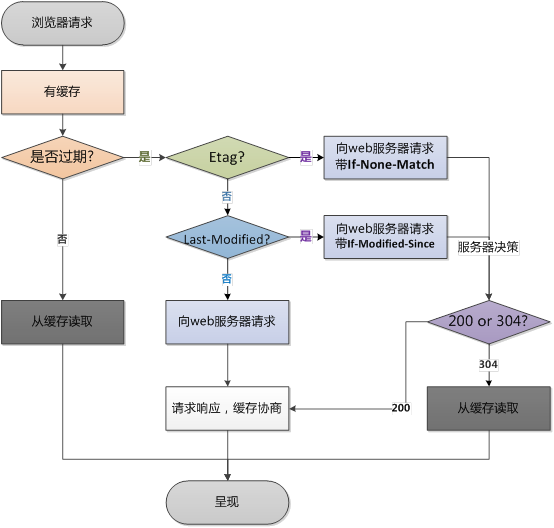

<!-- TOC -->

- [1. 盒模型](#1)
- [2. BFC](#2-bfc)
- [3. 浏览器相关](#3)
- [4. 说说你对语义化的理解](#4)
- [5. 说说H5新增内容](#5-h5)
- [6. 浏览器缓存机制](#6)
- [7. Cookie、 LocalStorage 与 SessionStorage区别](#7-cookie-localstorage--sessionstorage)

<!-- /TOC -->
### 1. 盒模型
盒子模型主要有两种  
w3c标准盒模型（声明了文档类型则以标准模式解析，H5声明方式是<!DOCTYPE html>，H4则需要设置DTD类型，包括严格和过渡)  
IE下的怪异盒模型（如果doctype缺失，则在ie6、ie7、ie8将会触发怪异模式）

还有用来改变盒模型width范围的一个css3的属性, box-sizing:
设置为'border-box'时, width = border + padding + content;
设置为'content-box'时, width = content。

垂直外边距合并  
1. 相邻元素之间
毗邻的两个元素之间的外边距会折叠（除非后一个元素需要清除之前的浮动）。

2. 父元素与其第一个或最后一个子元素之间
父子组件的折叠触发, 要求不能有间隙, 就是父组件不能设置border或padding值, 不能有空余的内容, 且同时有margin值。
```
 <div class="outer">
   <div class="inner"></div>
 </div>

    .outer {
      width: 200px;
      height: 100px;
      margin: 10px;
      background-color: #dedede;
    }
    .inner{
      width: 100px;
      height: 50px;
      margin: 10px;
      background-color: #bcbcbc;
    }
```

如果有间隙的话是不会触发折叠的, 比如父级元素设置了padding


常见不产生外边距重叠的方法是创建BFC

### 2. BFC
定义：块级格式化上下文，它是单独的一块渲染区域，有着自己的渲染规则，不同的BFC之间互不影响  
触发BFC的情况有以下情况：  
* 根元素或其它包含它的元素
* 浮动元素 (元素的float不是none)
* 绝对定位元素 (元素具有 position 为 absolute 或 fixed)
* 块元素具有overflow ，且值为scroll、hidden，不是visible
* 内联块inline-block(元素具有 display: inline-block)
* 表格单元格 (元素具有 display: table-cell，HTML表格单元格默认属性)
* 表格标题 (元素具有 display: table-caption, HTML表格标题默认属性)
注意，根元素就创建了一个BFC

BFC有以下特性：
* 内部块级盒子垂直方向排列
* 盒子垂直距离由margin决定，同一个BFC的盒子外边距会合并
* BFC就是一个隔离的容器，内部子元素不会影响到外部元素
* 每个元素的margin box的左边， 与包含块border box的左边相接触(对于从左往右的格式化，否则相反)。即使存在浮动也是如此(比如文字环绕效果就是因为该原因)。
* BFC的区域不会与浮动元素叠加，计算BFC的高度时，浮动元素也参与计算。

BFC用途：
* 清除浮动;
* 解决外边距合并;
* 布局;  
参考文章： [CSS中的BFC](https://www.w3cplus.com/css/understanding-block-formatting-contexts-in-css.html)

### 3. 浏览器相关
浏览器内核主要有： 
* IE浏览器内核：Trident内核，也是俗称的IE内核；
* Chrome浏览器内核：统称为Chromium内核或Chrome内核，以前是Webkit内核，现在是Blink内核；
* Firefox浏览器内核：Gecko内核，俗称Firefox内核；
* Safari浏览器内核：Webkit内核；
* Opera浏览器内核：最初是自己的Presto内核，后来是Webkit，现在是Blink内核； 
 
浏览器组成：  

  
如图我们可以知道浏览器引擎和JavaScript引擎不是同一回事，这个也就说明了为什么JavaScript是单线程但是浏览器可以异步发起请求的问题。

各个浏览器渲染引擎之间的差异与渲染引擎是怎样工作的
   
对比之后我们可以发现Gecko内核是需要先解析HTML然后再解析CSS，webkit内核是并行执行的。所以webkit内核在解析CSS这方面会相对高效

### 4. 说说你对语义化的理解
选择合适的标签（代码语义化）像标题（H1~H6）、列表（li）、强调（strong em）等等，便于开发者阅读和写出更优雅的代码的同时让浏览器的爬虫和机器很好地解析。

* 为了在没有CSS的情况下，页面也能呈现出很好地内容结构、代码结构；
* 用户体验：例如title、 alt 用于解释名词或解释图片信息、 label 标签的活用；
* 有利于SEO：和搜索引擎建立良好沟通，有助于爬虫抓取更多的有效信息：爬虫依赖于标签来确定上下文和各个关键字的权重；
* 方便其他设备解析（如屏幕阅读器、盲人阅读器、移动设备）以意义的方式来渲染网页；
* 便于团队开发和维护，语义化更具可读性，是下一步网页的重要动向，遵循W3C标准的团队都遵循这个标准，可以减少差异化。

```
<header></header>
<footer></footer>
<nav></nav>
<section></section>
<article></article>
<aslde></aside> 
<figure></figure> 创建图（默认有40px左右margin）。
<figcaption></figcaption> figure的标题，必须是figure内嵌的第一个或者最后一个元素。
<blockquoto></blockquoto> 引述文本，默认新的一行显示。
<time></time>：标记时间
<address></address> 作者、相关人士或组织的联系信息（电子邮件地址、指向联系信息页的链接）。
<datalist></datalist> 选项列表，与input元素配合使用，来定义input可能的值
<details></details> 用于描述文档或者文档某个部分的细节, 配合 summary 标签一起
```

### 5. 说说H5新增内容
* 语义化更好的内容标签（header,nav,footer,aside,article,section）音频、视频API(audio,video)
* 新增input type类型（如email url number range Date pickers (date, month, week, time, datetime, datetime-local) search color）
* 拖拽释放API，画布CanvasAPI，地理API
* sessionStorage和localStorage本地存储
* webworker、websocket等新技术

### 6. 浏览器缓存机制

1. 浏览器会查询Cache-Control(使用Expires也是可以的，但是Expires一般是绝对时间，Cache-Control设置的是相对时间)来判断内容是否过期，如果未过期则直接读取浏览器文件，不发送HTTP请求，否则进入下一步
2. 在浏览器端判断上次文件返回头里是否含有Etag信息，有则连同If-None-Match字段发送请求，服务器判断Etag未修改则返回304状态码，修改则返回200，否则进入下一步
3. 在浏览器端判断上次文件返回头里是否含有Last-Modified信息，有则连同If-Modified-Since字段发送请求，服务器判断Last-Modified是否失效，失效返回200，未失效返回304

### 7. Cookie、 LocalStorage 与 SessionStorage区别
| 特性 | Cookie| SessionStorage | LocalStorage |
|------| ------ | ------ | ------ |
|数据的生命期 | 一般由服务器生成，可设置失效时间。如果在浏览器端生成Cookie，默认是关闭浏览器后失效 | 仅在当前会话下有效，关闭页面或浏览器后被清除 | 除非被清除，否则永久保存 |
|存放数据大小 |  4K左右 |一般为5MB |
|与服务器端通信 |  每次都会携带在HTTP头中，如果使用cookie保存过多数据会带来性能问题 |不参与和服务器的通信 |
相同点： 都有同源限制
localStorage和sessionStorage具有相同的操作方法，例如key、setItem、getItem和removeItem、clear等
> 注意： 通过点击链接（或者用了 window.open）打开的新标签页之间是属于同一个 session 的，但新开一个标签页总是会初始化一个新的 session，即使网站是一样的，它们也不属于同一个 session。（参考：[Sessionstorage共享注意](https://github.com/lmk123/blog/issues/66)）

